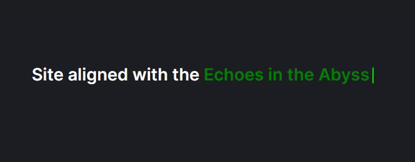

# Relearn07-Title Typing
Welcome to my Relearning Adventure! In this project, I will be showcasing my skills and brief examples of what I am doing, or at least relearning.

## Table of Contents

- [Introduction](#introduction)
  This section provides an overview of the project, highlighting the motivation and goals behind my relearning journey.

- [Features](#features)
  Discover the key features implemented within, showcasing the various elements and functionalities.

- [Sites](#sites)
  Explore the external sites and resources that played a significant role in shaping and enhancing this project.

## Introduction

This is where I share insights into the motivation and objectives driving my Title Typing Recreation. Join me on this relearning adventure!

## Features

Here, you'll find a detailed list of the distinctive features incorporated into the Title Typing, each contributing to the overall aesthetics and functionality.

## Sites

### [Youtube](https://www.youtube.com/)
Valuable tutorials and insights from the YouTube community played a pivotal role in refining my skills. Learn more about the impactful videos that influenced this project.

### [Font Awesome](https://fontawesome.com/) 
Utilized a variety of icons from Fontawesome to enhance the visual appeal and user interaction. Explore how these icons contribute to the overall design.

### [Google Fonts](https://fonts.google.com/)
Incorporated diverse fonts from Google Fonts to add a typographic dimension, ensuring a harmonious and engaging design. Discover the thought process behind font selection and its impact on the user experience.

### [Lorem Ipsum](https://www.lipsum.com/feed/html)
Explore the usage of Lorem Ipsum, a random text generation site, in the design process. Understand its role in placeholder content and design refinement.

### [Flat ui Colors](https://flatuicolors.com/palette/defo)
Explore the different palettes carelly picked and made so that any users and freely copy and paste for their own use.

### [Click here to view the Title Typing creation](https://davidhccnguyen.github.io/Relearn07-Title-Typing/)